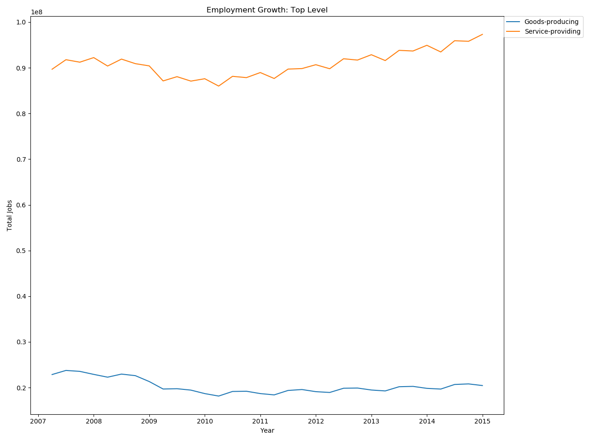

# Which industries can weather a recession?

An attempt to discern what industries fared the best in retaining jobs and maintaining wages through the 2007 recession.

# Overview

We are currently in one of the worst recessions in living memory. The COVID-19 pandemic has hobbled the American economy, with layoffs putting millions of Americans in precarious financial positions. Firms have collapsed or gone dark, education is being (temporarily?) reworked to be online-only. Jobless Americans are currently using their idle time to gain new marketable skills so they can reenter an extremely competitive workforce.

Job training is the solution to any and all "skills mismatch" problems in the labor market, or so our policy-makers believe. There are government-funded programs to help workers learn new skills. Americans looking to add to their skill sets can borrow to pay for education or reach into their own pockets. The decision of *what* new skills to learn, however, is left to individual workers.

This project is an attempt to describe the employment numbers from the last recession. I intend to compare the employment numbers across industries, to see which industries are the "safest" bets for workers to invest their resources into joining.

# Assumptions

* The BLS data in question is accurate.
* Inflation will be ignored (for now).
* We will concern ourselves only with job counts, not population counts or pro0portions of jobs to working-age/capable Americans.
* Average wage in each industry (the only available data) is generalizable to the working population.

# Questions

* What were the most "resilient" industries? Which industries had the shortest period between job losses and recovery to their pre-recession numbers?
* What does the distribution of wage and employment growth look like over the recession?

## Stretch Goals

1. How did wages fare when adjusted for inflation?
2. Which region(s) were the highest recovery/growth areas for the most resilient industries? (I know you want maps, Land)
3. Are there any familiar trends in the *current* (Q1-Q2 2020) recession?

# Dataset

I will be using data from the U.S. Bureau of Labor Statistics' Quarterly Census of Employment and Wages. Data exists as far back as 1990 (for the current questionnaire), however we will only concern ourselves with the months between Q1 2007 (the "official" start of the recession) to Q4 2014 (The year in which the American economy achieved the same overall job numbers as when the recession began).

The below image illustrates the length and severity of the 2007 recession:

## File too large!

I started with the *full* dataset from the BLS website (Found here:https://data.bls.gov/cew/data/files/2007/csv/2007_qtrly_singlefile.zip). The compressed file was approximately 500 megs, and uncompressed to 2.2 gigs. And that was only for one year.

I spent a good portion of a day trying to spin up an AWS instance. When that ultimately failed, I messaged a friend with an incredibly powerful gaming/streaming machine at his disposal. He allowed me to remote into the machine and open up the file to take a look- and the file was orders of magnitude too detailed for my purposes. It contained a line for every US County (~3,100) and industry (~2,600) *combinations*, times 4 since these results are quarterly. I only need one of those dimensions (industry) so I started fresh, grabbing the full data by area. That download is split into hundreds of files for different counties and states, but it contains a file for the entire US, which is a much more reasonable dataset. I quickly grabbed that file for every year in question (2007-2014).

Next came the task of getting all these files into a format that I wanted. I wrote some dictionaries and lists (stored in lookups.py) collect the schemas and the data I wanted to keep, so I could functionize the importing process and ensure repeatability. I wrote functions to import a single file, convert to the correct schema, and then drop unneeded columns. Then I added a function to pull all files into a single dataset. And I found myself working with a reasonable 150k rows of data, as opposed to the 251,280,000 the other path would have given me. This has the downside of removing location as a possible independent variable to explore, but tweaking the lookup tables would allow me to easily repeat all of my steps to to an area-based analysis instead of an industry one.

## Dataset Metadata:

||Variable|Count|Type|Description|
|---|---|---|---|---|
|0|industry_code|149772|int32|Numeric code for industry|
|1|agglvl_code|149772|object|Aggregation Level of Industry|
|2|year|149772|int6|44 digit Year|
|3|qtr|149772|int64|1 digit quarter|
|4|industry_title|149772|object|Full name of each industry|
|5|agglvl_title|149772|object|Full description of aggregation level|
|6|qtrly_estabs_count|149772|int64|Full count of firms in each industry operation for that quarter|
|7|month1_emplvl1|49772|int64|Count of total employees in industry for month 1 of the qtr|
|8|month2_emplvl1|49772|int64|Count of total employees in industry for month 2 of the qtr|
|9|month3_emplvl1|49772|int64|Count of total employees in industry for month 1 of the qtr|
|10|total_qtrly_wages|149772|int64|Total wages earned in that industry for the quarter (whole dollars)|
|11|avg_wkly_wage|149772|int64|Average wage for employees in the industry|
|12|qtrid|149772|float64|Composite of year and qtr [(year + qtr) * 4]|

 This table provides the raw data that will generate the variables I really care about: growth over the time period in both wages and employment, when the industry "peaked" in the early years of the recession, and when the industry recovered. I transformed the data into two seperate timeline tables, tracking the employment and wage numnbers over the relevant quarters. In each table I computed the relevant derived vairables, then joined both the employee and wage timeline tables, dropping the time series and retaining only the derived variables.

||Variable|Count|Type|Description|  
|---|---|---|---|---|
|0|industry_code|2447|int64|Numeric code for industry|
|1|industry_title|2447|object|Full name of each industry|
|2|recovery_wage|2447|float64|Quarter in which wages surpassed pre-recession peak|
|3|peak_wage|2363|float64|Pre-recession peak wages|
|4|growth_wage|2160|float64|2014q4 wages - peak_wage|
|5|growth_pcg_wage|2160|float64|100 * ( growth_wage / peak_wage )|
|6|recovery_empl|2447|float64|Quarter in which employment surpassed|
|7|peak_empl|2363|float64|Pre- recession peak employment|
|8|growth_empl|2160|float64|2014 q4 employment - peak_empl|
|9|growth_pcg_empl|2160|float64|100* ( growth_empl / peak_empl )|

 Now that I have the data I want, it's time for some top-level exploration.

 ## Industry codes and how to understand the dataset:

Each measurement (row) in the dataset is not necessarily unique- there is a good deal of aggregation going on. Understanding the aggregation levels is key to understanding how this dataset works.

You can tell what "level" of data you're looking at by the industry code. For some truly bird's eye views of the data, you can look at # 10 (total of all industries). Below that are 101 and 102, Goods and Services, respectively. Beneath that you have 1011 (Natural Resources), 1012 (Construction), 1013(Manufactoring) 1021 (Trade/Transit/Utilities), 1022(Information), and 1023 (Finance). You might be seeing a pattern emrege.

The rest of the data is divided similarly, although the previously mentioned sections have overlap within the remainder of the dataset, the remainder is primarily what we are intersted in. You can tell what an industries "parent"(a higher level aggregation) is by chopping off the last digit, and you can bet that it will be divided into smaller slices by adding digits to the end of it.

For example, Forestry and Logging (113) is part of Agriculture, Forestry, Fishing and Funting (11). You can find Forest Nursery (1132) and Logging (1133) within 113.

*Crucially, this allows me to be selective about the granularity of the industries I'm examining.*

##Some basic exploration:

Let's take a look at the employment and wage timelines for those bird's-eye aggregations.

It should be obvious that most of these aggregations are severly affected by cyclical employment cycles. We can see general trends thorughout the duration of the recession, but there's too much cyclical noise to draw anything really useful.

Given that some industries are cyclical (retail, farming) and some are stable (information systems, health care), lets go all the way down to generation 5, the most granular aggregation data we have (industry code > 100,000) and see the top 10 best-performing industries on both wages and employment.

These charts reveal two things- 1- there is no obvious commonailty between the industries in question, and 2- there are some massive spikes/drops in the data.

# A major caveat about the dataset:

The dataset is impeccibly clean- but it does have some nasty historical artifacts. During several years in question, some routine reclassifcation work affected the data, moving firms from one industry classification to another, consolidating industry groups and depreciating others. *Unfortunately, these cahnges were not applies retrospectively.* As such, there are quite a few industries that "drop off" the data entirely and will be shown to be incredibly poor performers.

This requires quite a few masks needed, to get rid of nans and industries that no longer exist in this classifcation scheme. This has a noticeable effect on my ability to functionize much of my work.

Additionally, this can introduce some type-1 errors within the findings.

### Can the data be cleaned?

Without a key of what was transferred where, probably not. Analysis can be done on which industries were affected but likely not specifically how. I've reached out to the BLS as the link to said key gives a 404 error.

For now, I will proceed with dropping the "dead" rows from my analysis.

# Analysis

Plotting the distributions of our four main variables shows us the following:

Wage growth and employment growth are roughly normal distributions (but the means of those distributions are scary. < 2% for wages and < 0 for employment.)

Wage recovery is a bit odd. It *wants* to be a normal distribution, and it might be if the data was smoothed over each year and extended back further in time, with a mean in 2010 or so. This speaks to a lopsidedness in the size of industries, though. Given the total economy (industry code 10) didn't recover until May 2014 . . .those industries that recovered more slowly are far larger than those that recovered quickly.

The employment recovery distribution actually points to a flaw in our data. That giant spike in 2010 speaks to a mistaken assumption at the onset of this project. Two years into the decline, some industries immidiatly bounced back, but there's a possibility these could be affected by industries with extremly long lag time.

# Hypotheses

The employment numbers, with their issues of reclassification and the mistraken assumption at the outset, presents an issue as far as making hypotheses. We do not have any indication of how this affects the overall results.

Because of this, I will predict that *given this dataset* and classifications, relationships between employment recovery time and our other three variables will not be significant. However, that still leaves the question of how each variable will be related to one another.

Using a Pearson correlation, I will attempt to discern relationships between our four key variables.

## Testing

Wage Recovery : Employment Recovery

H(0) : r ~ 0, p  <0.05

H(A) : r > 0, p  <0.05

prediction: H(0)

Reasoning: Employment Recovery is not reliable

Wage Recovery : Employment Growth

H(0) : r ~ 0, p  <0.05

H(A) : r > 0, p  <0.05

prediction: H(A)

Reasoning: Growth industries quickly will see higher wages

Wage Growth : Employment Growth

H(0) : r ~ 0, p  <0.05

H(A) : r > 0, p  <0.05

prediction: H(A)

Reasoning: Growth Industries growing quickly will see higher wages

Wage Growth : Employment Growth

H(0) : r ~ 0, p  <0.05

H(A) : r > 0, p  <0.05

prediction: H(0)

Reasoning: Employment Recovery is not reliable

Wage Recovery : Wage Growth

H(0) : r ~ 0, p  <0.05

H(A) : r > 0, p  <0.05

prediction: H(A)

Reasoning: Industries that have wages recover more quickly will continue to prosper and increase pay.

Employment Recovery : Employment Growth

H(0) : r ~ 0, p  <0.05

H(A) : r > 0, p  <0.05

prediction: H(A)

Reasoning: Industries that have wages recover more quickly will continue to prosper and increase pay.

Reasoning: This is where the issues with the EMployment Recovery and the potential for Typpe 1 errors converge. I am predicting a relationship but it might not be trustworthy.

# Further Research/Work

This data is illuminating, but incomplete. To delve more into this topic:

1. Run the analysis on *county* rather than industry. This will remove the data classification issues.
2. Get the changelog from BLS and run corrections on the industry data
3. Repeat the analysis on different generations (levels of aggregation)
4. Broaden the time period involved (to capture the possibility of a normal distribution in wage recovery).
5. Adjust the metrics:
  a. Calculate the nadir of wage/employment
  b. Calculate the peak *before* the nadir
  c. Calculate the recovery after the nadir
  d. Add decline time and recovery time as dependent variables.
6. Produce a "report card" function than can give a complete description of an industry- how it performed, what percentile it landed in.

# Further Research/Work

This data is illuminating, but incomplete. To delve more into this topic:

1. Run the analysis on *county* rather than industry. This will remove the data classification issues.
2. Get the changelog from BLS and run corrections on the industry data
3. Repeat the analysis on different generations (levels of aggregation)
4. Broaden the time period involved (to capture the possibility of a normal distribution in wage recovery).
5. Adjust the metrics:
  a. Calculate the nadir of wage/employment
  b. Calculate the peak *before* the nadir
  c. Calculate the recovery after the nadir
  d. Add decline time and recovery time as dependent variables.
6. Produce a "report card" function than can give a complete description of an industry- how it performed, what percentile it landed in.
